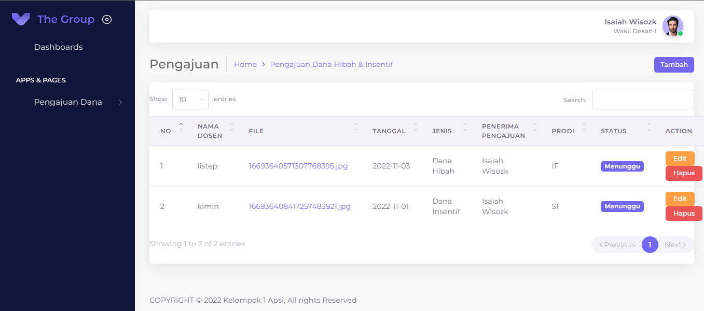

# Dynamic portfolio website

### `Introduction`

This application project was created to meet the needs of applying for grants and reviewer incentives so that they can assist the process of lecturers and staff in conducting research. This application is still not completely perfect, if anyone wants to contribute, please create a new branch and do a pull request🙌😁

### How to Run?

1. Clone this Project
2. On your command, type cd Sistem_Pengajuan_Penelitian
3. type `code .`
4. On your Code editor, open terminal and then type `npm install`
5. Run the project by typing `php artisan serve`
6. Happy Testing

### Output Of this Project

1. Login Page

2. Dashboard Admin

3. Dashboard Wakil Dekan 1

4. Dashboard Wakil Dekan 2

5. Dashboard Staff

